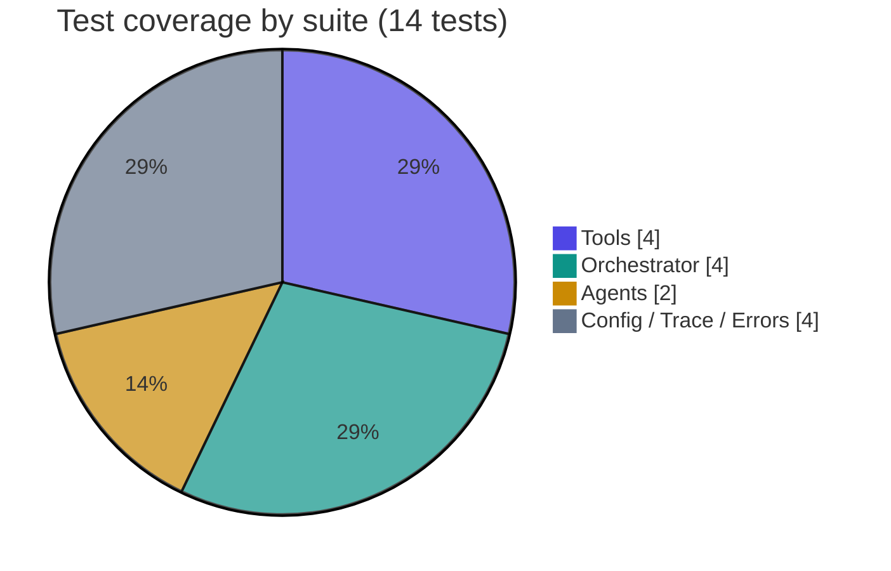
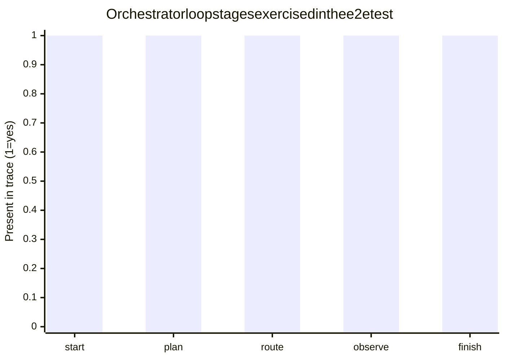
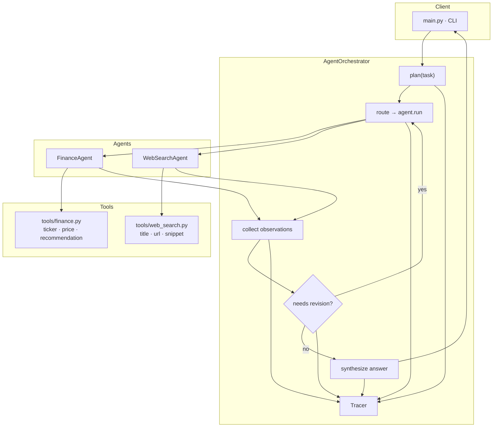
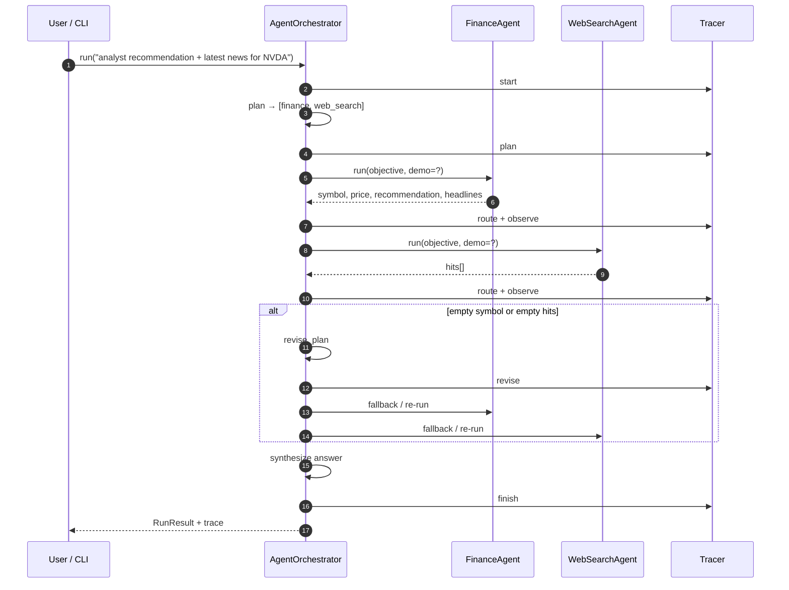
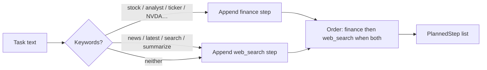
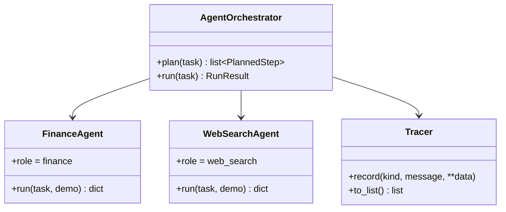
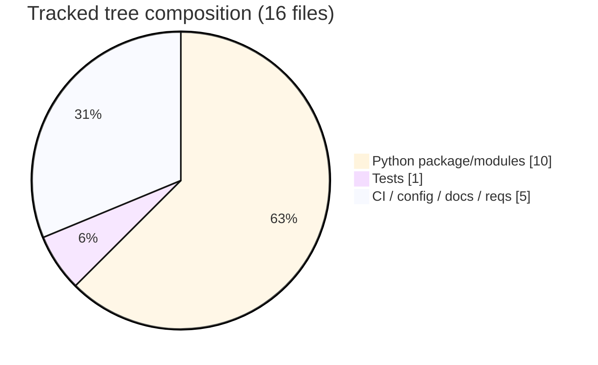

# Multi-Agent AI System

### Plan → route → observe → revise orchestration for finance + web-search tasks

[](https://github.com/ArchanaChetan07/Multi-Agent-AI-System/actions/workflows/ci.yml)
[](https://www.python.org/)
[](tests/test_multi_agent.py)
[](multi_agent/agents.py)
[](multi_agent/config.py)
[](https://github.com/ArchanaChetan07/Multi-Agent-AI-System)

> A **compact, framework-light multi-agent orchestrator** that decomposes a natural-language market question into specialized **Finance** and **Web Search** agent steps, collects observations, revises the plan when tools return empty signals, and emits a structured answer with a full execution **trace**.

**Repo:** [github.com/ArchanaChetan07/Multi-Agent-AI-System](https://github.com/ArchanaChetan07/Multi-Agent-AI-System)

---

## Why this exists

Most “multi-agent” demos hide behind a heavy SDK and fail in CI without API keys. This project keeps the **control loop explicit in-repo**:

| Concern | Approach |
|---|---|
| Planning | Keyword/intent decomposition → ordered agent steps |
| Specialization | `FinanceAgent` · `WebSearchAgent` with typed tool outputs |
| Adaptation | Observe → revise when finance lacks a symbol or search lacks hits |
| Operability | Structured `Tracer` events (`plan` / `route` / `observe` / `revise` / `finish`) |
| Offline CI | `DEMO_MODE` deterministic stubs (no Phi / LangChain required for green tests) |
| Optional polish | Groq completion only when `GROQ_API_KEY` is set |

---

## Verified results

| Metric | Value | Evidence |
|---|---|---|
| Unit / integration tests | **14 / 14 passed** | `pytest tests/ -v` (DEMO_MODE=1) |
| Tracked source files on `main` | **16** | `git ls-tree -r HEAD` |
| Agent roles | **2** (`finance`, `web_search`) | `multi_agent/agents.py` |
| Orchestration stages | plan → route → observe → revise → synthesize | `multi_agent/orchestrator.py` |
| Trace event kinds exercised | `plan`, `route`, `observe`, `finish` (+ `revise` when needed) | `tests/test_multi_agent.py` |
| Default dual-agent plan | `["finance", "web_search"]` for NVDA-style tasks | `TestOrchestrator.test_plan_routes_finance_and_search` |
| CI | GitHub Actions | `.github/workflows/ci.yml` |





---

## Architecture



### Control loop (sequence)



### Planning policy



---

## Example run (DEMO_MODE)

```bash
DEMO_MODE=1 python main.py "Summarize analyst recommendation and share the latest news for NVDA"
```

**What the orchestrator does**

1. Plans `finance` then `web_search`
2. Finance stub resolves ticker **NVDA** with deterministic demo price / recommendation
3. Web search stub returns tagged `[DEMO]` hits
4. Emits a synthesized answer + a machine-readable event trace

```bash
DEMO_MODE=1 python main.py "…NVDA…" --json
```

JSON includes `plan`, `observations`, `revisions`, `answer`, and `trace`.

---

## Agent & tool contracts

| Component | Role | Output fields (key) |
|---|---|---|
| `FinanceAgent` | Market / analyst snapshot | `symbol`, `price`, `currency`, `recommendation`, `news_headlines`, `source` |
| `WebSearchAgent` | Context search | `hits[{title,url,snippet}]`, `summary` |
| `finance_lookup` | Ticker extract + demo/live lookup | `FinanceSnapshot` |
| `web_search` | Deterministic demo hits or live path | `list[SearchHit]` |
| `Tracer` | Structured spans | `kind`, `message`, `data`, timestamp |
| `optional_groq_complete` | Optional narrative polish | string · only with `GROQ_API_KEY` |



---

## Repository facts

```text
Multi-Agent-AI-System/          ← 16 tracked files on main
├── main.py                     CLI (task, --live, --json, --groq-polish)
├── multi_agent/
│   ├── orchestrator.py         plan → route → observe → revise → synthesize
│   ├── agents.py               FinanceAgent · WebSearchAgent
│   ├── config.py               DEMO_MODE / Groq detection
│   ├── tracing.py              event tracer
│   └── tools/
│       ├── finance.py
│       └── web_search.py
├── tests/test_multi_agent.py   14 offline tests
├── requirements.txt
├── requirements-optional.txt   richer stacks (optional)
├── .env.example
└── .github/workflows/ci.yml
```



No committed virtualenv. No secrets in source. Optional live tools behind flags — **CI stays green offline**.

---

## Quick start

```bash
git clone https://github.com/ArchanaChetan07/Multi-Agent-AI-System.git
cd Multi-Agent-AI-System

python -m venv .venv
# Windows: .\.venv\Scripts\Activate.ps1
source .venv/bin/activate

pip install -r requirements.txt
cp .env.example .env   # optional: DEMO_MODE=1 or GROQ_API_KEY=...

# Offline demo (recommended first run)
DEMO_MODE=1 python main.py "Summarize analyst recommendation and share the latest news for NVDA"

# Tests
DEMO_MODE=1 pytest tests/ -v
```

| Flag | Meaning |
|---|---|
| `--live` | Prefer live tools (orchestrator still demo-safe on failure paths) |
| `--json` | Emit full `RunResult` as JSON |
| `--groq-polish` | If `GROQ_API_KEY` set, polish the synthesized answer |

---

## Skills surface

`Python` · `multi-agent systems` · `agent orchestration` · `plan-execute-observe-revise` · `tool calling` · `finance agent` · `web search agent` · `structured tracing` · `DEMO_MODE` · `deterministic stubs` · `pytest` · `GitHub Actions CI` · `CLI productization` · `optional Groq / LLM polish` · `separation of agents vs tools vs orchestrator`

---

## Design notes

1. **Orchestration is code, not a mystery SDK** — easy to audit and interview through.  
2. **Agents are thin; tools are swappable** — demo stubs vs live finance/search behind the same interface.  
3. **Revision is explicit** — empty finance symbol or empty search hits trigger a fallback plan.  
4. **Honest size** — **16** tracked files; the old Phi/`myenv` bloat is gone from the tree.

---

## Roadmap

- Fixture JSON traces for golden-path regression  
- Pluggable backends (LangChain / Phi) behind the same `AgentRole` protocol  
- HTTP API wrapper (`/run`) with the same `RunResult` schema  

---

## Author

**Archana Chetan** · [@ArchanaChetan07](https://github.com/ArchanaChetan07)

Built as a **clean multi-agent systems sample**: explicit planning, specialized roles, observe/revise control flow, offline-first testing, and optional LLM polish.

---

## License

See repository license if present.
