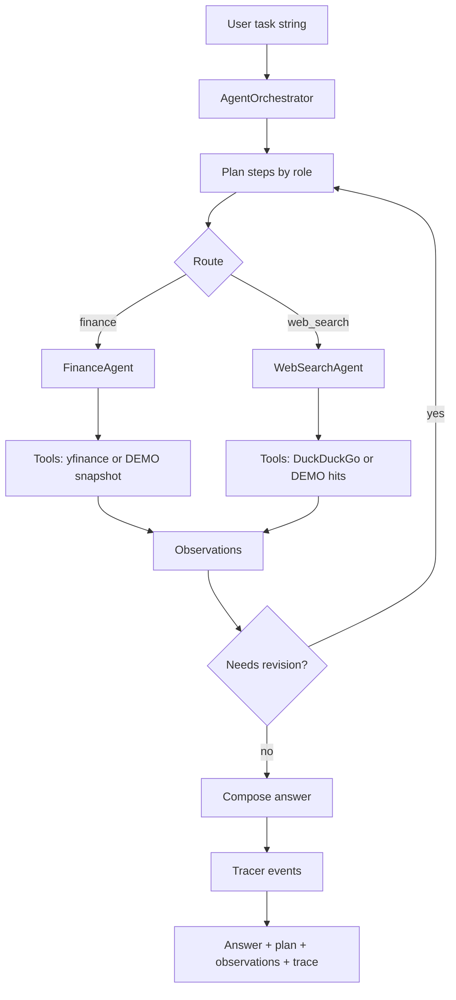

# Multi-Agent AI System

### Finance + web-search agents orchestrated with plan → observe → revise tracing

[](https://github.com/ArchanaChetan07/Multi-Agent-AI-System/actions/workflows/ci.yml)
[](https://www.python.org/)
[](tests/test_multi_agent.py)
[](#license)

Lightweight multi-agent runner that turns a natural-language market question into a routed plan, executes specialized agents (finance + web search), optionally revises when observations are empty, and returns an answer with a structured execution trace. Designed to run fully offline in **DEMO_MODE** for CI, with optional live tools (yfinance / DuckDuckGo / Groq).

---

## Key Results

| Metric | Value | Source |
|---|---|---|
| Agent roles | **2** (`finance`, `web_search`) | `multi_agent/agents.py` |
| Orchestrator stages | plan → route → observe → revise → finish | `multi_agent/orchestrator.py` |
| Unit tests | **14** | `tests/test_multi_agent.py` |
| Offline CI path | `DEMO_MODE=1` (deterministic tool stubs) | `multi_agent/config.py` |
| CLI modes | text / `--json` / `--live` / `--groq-polish` | `main.py` |
| Tracked source files | **16** | git tree |

---

## Architecture



**How it works:** heuristic planning inspects the task text for finance vs news cues, runs the matching agents, revises to both roles if observations are empty, and records every stage in a `Tracer` for debugging/CI assertions.

---

## Tech Stack

| Layer | Choice |
|---|---|
| Language | Python 3 |
| Core deps | `python-dotenv`, `pytest` |
| Optional live tools | `yfinance`, `duckduckgo-search`, `groq` |
| Optional polish model | Groq `llama-3.1-8b-instant` (env `GROQ_MODEL`) |
| CI | GitHub Actions + pytest under `DEMO_MODE` |

---

## Features

- Explicit agent roles with a shared `AgentRole` protocol
- Deterministic **DEMO** finance snapshots and search hits for offline runs
- Ticker extraction for symbols like `NVDA` / `AAPL` / `TSLA`
- End-to-end `RunResult` object (task, plan, observations, revisions, answer, trace)
- JSON CLI output for automation
- Optional Groq polish when `GROQ_API_KEY` is set (live path only)

---

## Installation & Usage

```bash
git clone https://github.com/ArchanaChetan07/Multi-Agent-AI-System.git
cd Multi-Agent-AI-System
python -m venv .venv
# Windows: .venv\Scripts\activate
source .venv/bin/activate
pip install -r requirements.txt
```

```bash
# Offline demo (default when no Groq key / DEMO_MODE=1)
python main.py "Summarize analyst recommendation and share the latest news for NVDA"

# Structured output
python main.py --json "price of AAPL stock"

# Prefer live tools (falls back to demo on failure)
pip install -r requirements-optional.txt   # if present / uncommented deps
python main.py --live "latest news for MSFT"

# Tests
pytest -q
```

---

## Project Structure

```text
Multi-Agent-AI-System/
├── main.py                      # CLI entrypoint
├── multi_agent/
│   ├── agents.py                # FinanceAgent, WebSearchAgent
│   ├── orchestrator.py          # plan / route / revise / finish
│   ├── config.py                # DEMO_MODE + Groq config
│   ├── tracing.py               # event tracer
│   └── tools/
│       ├── finance.py           # ticker extract + lookup
│       └── web_search.py        # search tool
├── tests/test_multi_agent.py    # 14 offline unit tests
├── requirements.txt
└── .github/workflows/ci.yml
```

---

## Sample Output (DEMO_MODE)

```text
NVDA @ <demo price> USD; recommendation=<demo>; source=demo
... plus DEMO web snippets ...

--- trace ---
[plan] ...
[route] ...
[observe] ...
[finish] ...
```

Tests assert trace kinds include `plan`, `route`, `observe`, and `finish` for the NVDA finance+news path.

---

## Future Improvements

- Add a critic/verifier agent before final answer composition
- Persist traces as OpenTelemetry spans for production ops
- Expand planning beyond keyword heuristics (LLM planner behind a feature flag)

---

## License

See repository license file if present.
