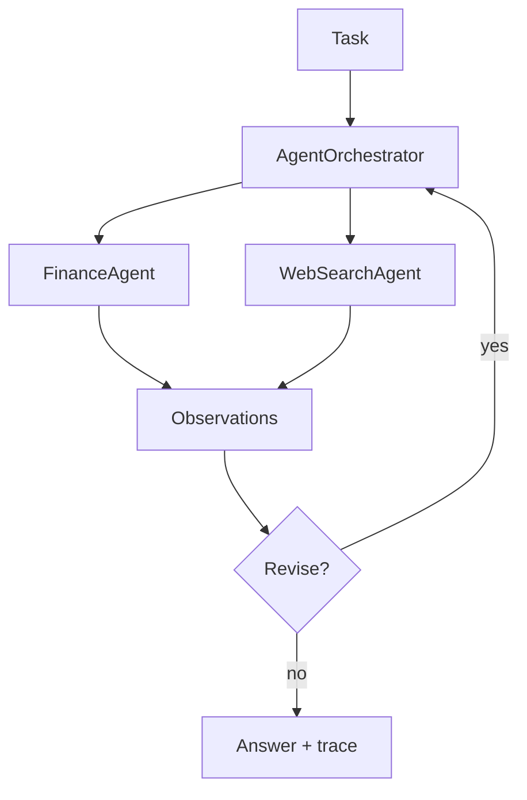
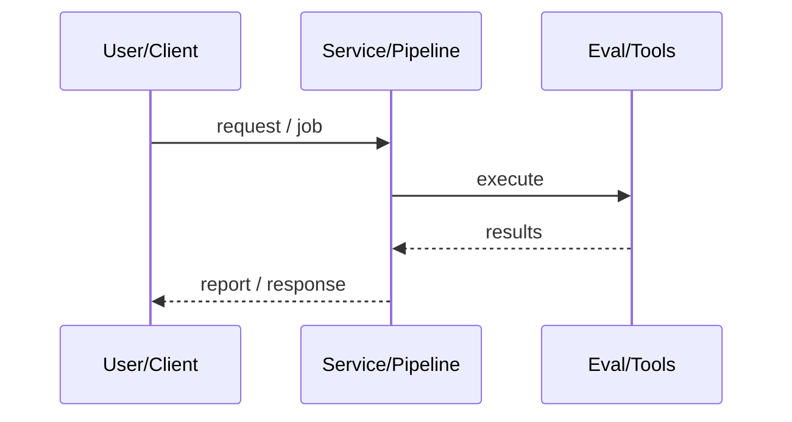
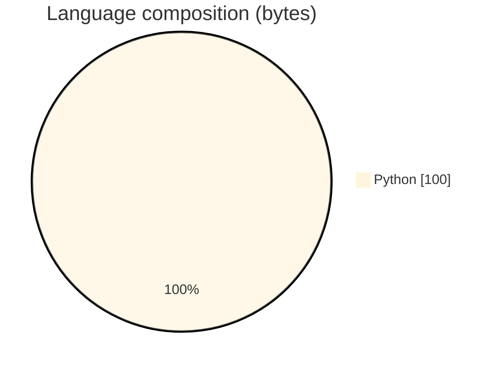

# Multi-Agent AI System (Finance + Web Search)

### Lightweight orchestrator that plans finance vs web-search steps, observes results, optionally revises, with DEMO_MODE and tracing.

[](https://github.com/ArchanaChetan07/Multi-Agent-AI-System)
[](https://github.com/ArchanaChetan07/Multi-Agent-AI-System)
[](https://github.com/ArchanaChetan07/Multi-Agent-AI-System)
[](https://github.com/ArchanaChetan07/Multi-Agent-AI-System/actions)

---

## Overview

Need a minimal, testable multi-agent scaffold for market questions without depending on a heavyweight framework for CI.

AgentOrchestrator plans steps from task keywords; FinanceAgent and WebSearchAgent tools; demo mode bypass; tracing list; pytest; optional requirements for richer stacks.

Compact 16-file repository demonstrating plan→route→observe→revise orchestration (README incorrectly claims 12k+ files).

This repository is maintained as **production-minded portfolio work**: clear architecture, automated checks where present, and metrics that are **traceable to committed artifacts** (never invented).

---

## Architecture

Task → Orchestrator.plan → FinanceAgent and/or WebSearchAgent → observations → optional revise → final answer + trace





---

## Results & repository facts

> Only values found in code, configs, tests, or generated reports are listed. Absence of a clinical/ML accuracy number means it was **not** published in-repo.

| Metric | Value | Source |
|---|---|---|
| Tracked blobs on main | **16** | `git tree main` |
| Tracked files | **16** | `git tree` |
| Python modules | **10** | `git tree` |
| Test-related paths | **1** | `git tree` |
| CI workflows | **Yes** | `.github/workflows` |
| Docker present | **No** | `repo root` |



---

## Key features

- Keyword-based multi-step planning
- Finance + web search agent roles
- Observation collection and revision hooks
- DEMO_MODE for offline tests
- Optional dependency extra file

---

## Tech stack

| Layer | Technology |
|---|---|
| language | Python |
| agents | FinanceAgent / WebSearchAgent |
| orchestration | AgentOrchestrator |
| observability | multi_agent/tracing.py |
| ci | GitHub Actions |

---

## Skills demonstrated

Python · custom orchestrator · pytest · CI/CD · testing · automation

Keyword surface: **Python · Python · machine-learning · CI/CD · testing · API · Docker · automation · data-science · software-engineering · system-design · observability · LLM · cloud**

---

## Project structure

```text
Multi-Agent-AI-System/
├── main.py
├── multi_agent/{orchestrator,agents,config,tracing}.py
├── multi_agent/tools/{finance,web_search}.py
├── tests/test_multi_agent.py
└── requirements.txt
```

---

## Installation & usage

```bash
git clone https://github.com/ArchanaChetan07/Multi-Agent-AI-System.git
cd Multi-Agent-AI-System
pip install -r requirements.txt
python main.py
```

---

## How it works

main constructs an AgentOrchestrator that decomposes a natural-language task into finance and/or web-search steps, executes agents, records observations/traces, and may revise the plan before synthesizing an answer—using demo stubs when enabled.

---

## Future improvements

- Fix README file-count exaggeration (12504 vs 16 blobs)
- Add example traces as fixtures
- Optional LangChain/phi backends behind the same interface

---

## License

See repository.

---

<p align="center">
  <b>Multi-Agent AI System (Finance + Web Search)</b><br/>
  <a href="https://github.com/ArchanaChetan07/Multi-Agent-AI-System">github.com/ArchanaChetan07/Multi-Agent-AI-System</a>
</p>
